# Jolly Home Needs — Master Data Guide, ER Diagram & Frontend Integration Reference

---

## 1. Complete Entity-Relationship (ER) Diagram

```mermaid
erDiagram
    USER ||--o| ROLE : "roleReference"
    USER ||--o| ACTIVE_STATUS : "activeStatusReference"
    ROLE ||--o{ PERMISSION : "permissionReferences"
    ROLE ||--o| ACTIVE_STATUS : "activeStatusReference"
    
    CUSTOMER ||--o| ACTIVE_STATUS : "activeStatusReference"
    TIME_SLOT ||--o| ACTIVE_STATUS : "activeStatusReference"
    PAYMENT_METHOD ||--o| ACTIVE_STATUS : "activeStatusReference"
    PAYMENT_ACCOUNT ||--o| ACTIVE_STATUS : "activeStatusReference"
    BATHROOM_COUNT ||--o| ACTIVE_STATUS : "activeStatusReference"
    SERVICE_DURATION ||--o| ACTIVE_STATUS : "activeStatusReference"
    SERVICE_FREQUENCY ||--o| ACTIVE_STATUS : "activeStatusReference"
    SUBSCRIPTION_TYPE ||--o| ACTIVE_STATUS : "activeStatusReference"
    WORK_STATUS ||--o| ACTIVE_STATUS : "activeStatusReference"
    PRICING ||--o| ACTIVE_STATUS : "activeStatusReference"

    PRICING ||--|| SERVICE_DURATION : "serviceDurationReference"
    PRICING ||--|| BATHROOM_COUNT : "bathroomCountReference"

    BOOKING ||--|| CUSTOMER : "customerReference"
    BOOKING ||--o| BATHROOM_COUNT : "bathroomCountReference"
    BOOKING ||--o| PRICING : "pricingReference"
    BOOKING ||--o| SERVICE_DURATION : "serviceDurationReference"
    BOOKING ||--o| SERVICE_FREQUENCY : "serviceFrequencyReference"
    BOOKING ||--o| SUBSCRIPTION_TYPE : "subscriptionTypeReference"
    BOOKING ||--o| TIME_SLOT : "timeSlotReference"
    BOOKING ||--o| BOOKING_DATE : "bookingDateReference"
    BOOKING ||--o| PAYMENT_METHOD : "paymentMethodReference"
    BOOKING ||--o| PAYMENT_ACCOUNT : "accountReference"
    BOOKING ||--o| WORK_STATUS : "workStatusReference"

    INVOICE ||--|| BOOKING : "bookingReference"
    INVOICE ||--|| CUSTOMER : "customerReference"

    USER {
        ObjectId _id PK
        string userName
        string email
        string passwordHash
        ObjectId roleReference FK
        ObjectId activeStatusReference FK
    }

    ROLE {
        ObjectId _id PK
        string roleName
        ObjectId[] permissionReferences FK
        ObjectId activeStatusReference FK
    }

    PERMISSION {
        ObjectId _id PK
        string permissionName
    }

    ACTIVE_STATUS {
        ObjectId _id PK
        string activeStatusName
    }

    CUSTOMER {
        ObjectId _id PK
        string name
        string phoneNumber
        string address
        string doorNo
        string block
        string apartmentName
        string landmark
        string city
        string pincode
        ObjectId activeStatusReference FK
    }

    BATHROOM_COUNT {
        ObjectId _id PK
        number bathroomCount
        ObjectId activeStatusReference FK
    }

    SERVICE_DURATION {
        ObjectId _id PK
        number durationMinutes
        ObjectId activeStatusReference FK
    }

    SERVICE_FREQUENCY {
        ObjectId _id PK
        string frequencyName
        ObjectId activeStatusReference FK
    }

    SUBSCRIPTION_TYPE {
        ObjectId _id PK
        string subscriptionName
        ObjectId activeStatusReference FK
    }

    TIME_SLOT {
        ObjectId _id PK
        string startTime
        string endTime
        number bufferTime
        ObjectId activeStatusReference FK
    }

    BOOKING_DATE {
        ObjectId _id PK
        date startDateTime
        date endDateTime
        ObjectId createdBy FK
    }

    PAYMENT_METHOD {
        ObjectId _id PK
        string paymentMethodName
        ObjectId activeStatusReference FK
    }

    PAYMENT_ACCOUNT {
        ObjectId _id PK
        string accountName
        ObjectId activeStatusReference FK
    }

    PRICING {
        ObjectId _id PK
        ObjectId serviceDurationReference FK
        ObjectId bathroomCountReference FK
        number price
        boolean isActive
        date effectiveFrom
        ObjectId activeStatusReference FK
    }

    WORK_STATUS {
        ObjectId _id PK
        string statusName
        ObjectId activeStatusReference FK
    }

    BOOKING {
        ObjectId _id PK
        ObjectId customerReference FK
        ObjectId bathroomCountReference FK
        ObjectId pricingReference FK
        ObjectId serviceDurationReference FK
        ObjectId serviceFrequencyReference FK
        ObjectId subscriptionTypeReference FK
        ObjectId timeSlotReference FK
        ObjectId bookingDateReference FK
        ObjectId paymentMethodReference FK
        ObjectId accountReference FK
        string transactionId
        number amount
        ObjectId workStatusReference FK
        ObjectId createdBy FK
    }

    INVOICE {
        ObjectId _id PK
        string invoiceNumber UK
        ObjectId customerReference FK
        ObjectId bookingReference FK
        number amount
        ObjectId createdBy FK
    }

    COUNTER {
        string _id PK
        number seq
    }

    AUDIT_LOG {
        ObjectId _id PK
        ObjectId userReference FK
        string operation
        string collectionName
        ObjectId recordReference
    }
```



---

## 2. Master Data Seed Reference Guide (Step-by-Step for Postman / Testing)

Follow this bottom-up sequence to populate initial system data without missing references.

### Global Setup
- **Base URL**: `http://localhost:5000`
- **Headers**:
  - `Content-Type: application/json`
  - `Authorization: Bearer <TOKEN>` *(required from Phase 2 onwards)*

---

### Phase 1: Bootstrap Root User & Authentication

#### Request 1.1: Create Root SuperAdmin User (Public)
- **POST** `/api/users`
```json
{
  "userName": "Super Admin",
  "email": "superadmin@jollyclean.com",
  "password": "Password@123"
}
```
*Save returned `_id` as `{{superAdminUserId}}`.*

#### Request 1.2: Login to Get Bearer Token
- **POST** `/api/users/login`
```json
{
  "email": "superadmin@jollyclean.com",
  "password": "Password@123"
}
```
*Save returned `token` as `{{token}}`. Use this in `Authorization: Bearer {{token}}` for all subsequent calls.*

---

### Phase 2: Active Statuses (System Flags)
Create the two system states used across all entities:

#### Request 2.1: Create "Active" Status
- **POST** `/api/statuses`
```json
{ "activeStatusName": "Active" }
```
*Save `_id` as `{{activeStatusId}}`.*

#### Request 2.2: Create "Inactive" Status
- **POST** `/api/statuses`
```json
{ "activeStatusName": "Inactive" }
```
*Save `_id` as `{{inactiveStatusId}}`.*

---

### Phase 3: Permissions (Granular Access Keys)

#### Request 3.1: Create "all" Permission (Full Access)
- **POST** `/api/permissions`
```json
{ "permissionName": "all" }
```
*Save `_id` as `{{permAllId}}`.*

#### Request 3.2: Create "read&write" Permission (Operator / Supervisor)
- **POST** `/api/permissions`
```json
{ "permissionName": "read&write" }
```
*Save `_id` as `{{permReadWriteId}}`.*

#### Request 3.3: Create "read" Permission (Viewer / Read-Only)
- **POST** `/api/permissions`
```json
{ "permissionName": "read" }
```
*Save `_id` as `{{permReadOnlyId}}`.*

---

### Phase 4: Roles (Role-Based Access Control)

#### Request 4.1: Role — `superadmin`
- **POST** `/api/roles`
```json
{
  "roleName": "superadmin",
  "permissionReferences": ["{{permAllId}}"],
  "activeStatusReference": "{{activeStatusId}}"
}
```
*Save `_id` as `{{roleSuperAdminId}}`.*

#### Request 4.2: Role — `admin`
- **POST** `/api/roles`
```json
{
  "roleName": "admin",
  "permissionReferences": ["{{permReadWriteId}}"],
  "activeStatusReference": "{{activeStatusId}}"
}
```
*Save `_id` as `{{roleAdminId}}`.*

#### Request 4.3: Role — `user` (Staff / Telecaller)
- **POST** `/api/roles`
```json
{
  "roleName": "user",
  "permissionReferences": ["{{permReadOnlyId}}"],
  "activeStatusReference": "{{activeStatusId}}"
}
```
*Save `_id` as `{{roleUserId}}`.*

#### Request 4.4: Link `superadmin` Role back to Root User
- **PUT** `/api/users/{{superAdminUserId}}`
```json
{
  "roleReference": "{{roleSuperAdminId}}",
  "activeStatusReference": "{{activeStatusId}}"
}
```

---

### Phase 5: Additional Staff Users (Admin & Telecaller)

#### Request 5.1: Create Admin User
- **POST** `/api/users`
```json
{
  "userName": "Operations Manager",
  "email": "admin@jollyclean.com",
  "password": "Password@123",
  "roleReference": "{{roleAdminId}}",
  "activeStatusReference": "{{activeStatusId}}"
}
```

#### Request 5.2: Create Telecaller User
- **POST** `/api/users`
```json
{
  "userName": "Telecaller One",
  "email": "caller1@jollyclean.com",
  "password": "Password@123",
  "roleReference": "{{roleUserId}}",
  "activeStatusReference": "{{activeStatusId}}"
}
```

---

### Phase 6: Payment Accounts (Bank Accounts & Desks)

#### Request 6.1: HDFC Bank
- **POST** `/api/accounts`
```json
{
  "accountName": "HDFC Bank - Current A/C (987654321)",
  "activeStatusReference": "{{activeStatusId}}"
}
```
*Save `_id` as `{{accHdfcId}}`.*

#### Request 6.2: IOB (Indian Overseas Bank)
- **POST** `/api/accounts`
```json
{
  "accountName": "IOB - Current A/C (123456789)",
  "activeStatusReference": "{{activeStatusId}}"
}
```
*Save `_id` as `{{accIobId}}`.*

#### Request 6.3: SBI (State Bank of India)
- **POST** `/api/accounts`
```json
{
  "accountName": "SBI - Main A/C (555666777)",
  "activeStatusReference": "{{activeStatusId}}"
}
```
*Save `_id` as `{{accSbiId}}`.*

#### Request 6.4: Cash Counter Desk
- **POST** `/api/accounts`
```json
{
  "accountName": "Office Cash Desk",
  "activeStatusReference": "{{activeStatusId}}"
}
```
*Save `_id` as `{{accCashDeskId}}`.*

---

### Phase 7: Payment Methods

#### Request 7.1: UPI
- **POST** `/api/payments`
```json
{
  "paymentMethodName": "UPI",
  "activeStatusReference": "{{activeStatusId}}"
}
```
*Save `_id` as `{{pmUpiId}}`.*

#### Request 7.2: Card
- **POST** `/api/payments`
```json
{
  "paymentMethodName": "Card",
  "activeStatusReference": "{{activeStatusId}}"
}
```
*Save `_id` as `{{pmCardId}}`.*

#### Request 7.3: Cash
- **POST** `/api/payments`
```json
{
  "paymentMethodName": "Cash",
  "activeStatusReference": "{{activeStatusId}}"
}
```
*Save `_id` as `{{pmCashId}}`.*

#### Request 7.4: Net Banking
- **POST** `/api/payments`
```json
{
  "paymentMethodName": "Net Banking",
  "activeStatusReference": "{{activeStatusId}}"
}
```
*Save `_id` as `{{pmNetBankingId}}`.*

---

### Phase 8: Bathroom Counts

| Bathroom Count | URL | JSON Body | Save Variable |
| :--- | :--- | :--- | :--- |
| **1 Bathroom** | `POST /api/bathrooms` | `{ "bathroomCount": 1, "activeStatusReference": "{{activeStatusId}}" }` | `{{bath1Id}}` |
| **2 Bathrooms** | `POST /api/bathrooms` | `{ "bathroomCount": 2, "activeStatusReference": "{{activeStatusId}}" }` | `{{bath2Id}}` |
| **3 Bathrooms** | `POST /api/bathrooms` | `{ "bathroomCount": 3, "activeStatusReference": "{{activeStatusId}}" }` | `{{bath3Id}}` |
| **4 Bathrooms** | `POST /api/bathrooms` | `{ "bathroomCount": 4, "activeStatusReference": "{{activeStatusId}}" }` | `{{bath4Id}}` |

---

### Phase 9: Service Durations

| Duration | URL | JSON Body | Save Variable |
| :--- | :--- | :--- | :--- |
| **1 Hour (60m)** | `POST /api/durations` | `{ "durationMinutes": 60, "activeStatusReference": "{{activeStatusId}}" }` | `{{dur60Id}}` |
| **2 Hours (120m)**| `POST /api/durations` | `{ "durationMinutes": 120, "activeStatusReference": "{{activeStatusId}}" }` | `{{dur120Id}}` |
| **3 Hours (180m)**| `POST /api/durations` | `{ "durationMinutes": 180, "activeStatusReference": "{{activeStatusId}}" }` | `{{dur180Id}}` |
| **4 Hours (240m)**| `POST /api/durations` | `{ "durationMinutes": 240, "activeStatusReference": "{{activeStatusId}}" }` | `{{dur240Id}}` |

---

### Phase 10: Service Frequencies

| Frequency | URL | JSON Body | Save Variable |
| :--- | :--- | :--- | :--- |
| **One-Time** | `POST /api/frequencies` | `{ "frequencyName": "One-Time", "activeStatusReference": "{{activeStatusId}}" }` | `{{freqOneTimeId}}` |
| **Weekly** | `POST /api/frequencies` | `{ "frequencyName": "Weekly", "activeStatusReference": "{{activeStatusId}}" }` | `{{freqWeeklyId}}` |
| **Bi-Weekly** | `POST /api/frequencies` | `{ "frequencyName": "Bi-Weekly", "activeStatusReference": "{{activeStatusId}}" }` | `{{freqBiWeeklyId}}` |
| **Monthly** | `POST /api/frequencies` | `{ "frequencyName": "Monthly", "activeStatusReference": "{{activeStatusId}}" }` | `{{freqMonthlyId}}` |

---

### Phase 11: Subscription Types

| Subscription | URL | JSON Body | Save Variable |
| :--- | :--- | :--- | :--- |
| **Standard (No Sub)**| `POST /api/subscriptions` | `{ "subscriptionName": "Standard", "activeStatusReference": "{{activeStatusId}}" }` | `{{subStandardId}}` |
| **3-Month Plan** | `POST /api/subscriptions` | `{ "subscriptionName": "3 Month Plan", "activeStatusReference": "{{activeStatusId}}" }` | `{{sub3MoId}}` |
| **6-Month Plan** | `POST /api/subscriptions` | `{ "subscriptionName": "6 Month Plan", "activeStatusReference": "{{activeStatusId}}" }` | `{{sub6MoId}}` |
| **Annual Plan** | `POST /api/subscriptions` | `{ "subscriptionName": "1 Year Plan", "activeStatusReference": "{{activeStatusId}}" }` | `{{subAnnualId}}` |

---

### Phase 12: Standard Time Slots

| Time Slot | URL | JSON Body | Save Variable |
| :--- | :--- | :--- | :--- |
| **Slot 1 (Morning)** | `POST /api/slots` | `{ "startTime": "09:00 AM", "endTime": "11:00 AM", "bufferTime": 30, "activeStatusReference": "{{activeStatusId}}" }` | `{{slot1Id}}` |
| **Slot 2 (Mid-Day)** | `POST /api/slots` | `{ "startTime": "11:30 AM", "endTime": "01:30 PM", "bufferTime": 30, "activeStatusReference": "{{activeStatusId}}" }` | `{{slot2Id}}` |
| **Slot 3 (Afternoon)** | `POST /api/slots` | `{ "startTime": "02:00 PM", "endTime": "04:00 PM", "bufferTime": 30, "activeStatusReference": "{{activeStatusId}}" }` | `{{slot3Id}}` |
| **Slot 4 (Evening)** | `POST /api/slots` | `{ "startTime": "04:30 PM", "endTime": "06:30 PM", "bufferTime": 30, "activeStatusReference": "{{activeStatusId}}" }` | `{{slot4Id}}` |

---

### Phase 13: Work Statuses (Booking Workflow States)

| Status | URL | JSON Body | Save Variable |
| :--- | :--- | :--- | :--- |
| **Scheduled** | `POST /api/work-statuses` | `{ "statusName": "Scheduled", "activeStatusReference": "{{activeStatusId}}" }` | `{{wsScheduledId}}` |
| **In Progress** | `POST /api/work-statuses` | `{ "statusName": "In Progress", "activeStatusReference": "{{activeStatusId}}" }` | `{{wsInProgressId}}` |
| **Completed** | `POST /api/work-statuses` | `{ "statusName": "Completed", "activeStatusReference": "{{activeStatusId}}" }` | `{{wsCompletedId}}` |
| **Cancelled** | `POST /api/work-statuses` | `{ "statusName": "Cancelled", "activeStatusReference": "{{activeStatusId}}" }` | `{{wsCancelledId}}` |

---

### Phase 14: Pricing Matrix (Duration + Bathroom Combinations)

#### Request 14.1: 1 Bathroom + 60 mins -> ₹1200
- **POST** `/api/pricing`
```json
{
  "serviceDurationReference": "{{dur60Id}}",
  "bathroomCountReference": "{{bath1Id}}",
  "price": 1200,
  "isActive": true,
  "activeStatusReference": "{{activeStatusId}}"
}
```

#### Request 14.2: 2 Bathrooms + 120 mins -> ₹2500
- **POST** `/api/pricing`
```json
{
  "serviceDurationReference": "{{dur120Id}}",
  "bathroomCountReference": "{{bath2Id}}",
  "price": 2500,
  "isActive": true,
  "activeStatusReference": "{{activeStatusId}}"
}
```
*Save `_id` as `{{pricing2BathId}}`.*

#### Request 14.3: 3 Bathrooms + 180 mins -> ₹3600
- **POST** `/api/pricing`
```json
{
  "serviceDurationReference": "{{dur180Id}}",
  "bathroomCountReference": "{{bath3Id}}",
  "price": 3600,
  "isActive": true,
  "activeStatusReference": "{{activeStatusId}}"
}
```

---

### Phase 15: Customers

#### Request 15.1: Create Customer One
- **POST** `/api/customers`
```json
{
  "name": "Kavitha Raman",
  "phoneNumber": "9840123456",
  "doorNo": "Flat 302",
  "block": "Block B",
  "apartmentName": "Prestige Bella Vista",
  "address": "Poonamallee High Road",
  "landmark": "Near Porur Toll Gate",
  "city": "Chennai",
  "pincode": "600056",
  "activeStatusReference": "{{activeStatusId}}"
}
```
*Save `_id` as `{{custKavithaId}}`.*

#### Request 15.2: Create Customer Two
- **POST** `/api/customers`
```json
{
  "name": "Arun Prakash",
  "phoneNumber": "9790987654",
  "doorNo": "12A",
  "block": "Tower 4",
  "apartmentName": "Olympia Opaline",
  "address": "Navalur OMR",
  "landmark": "Opposite Vivira Mall",
  "city": "Chennai",
  "pincode": "603103",
  "activeStatusReference": "{{activeStatusId}}"
}
```
*Save `_id` as `{{custArunId}}`.*

---

### Phase 16: Complete Booking Transaction (Pure Reference Architecture)

Creates the booking, sets `bookingDateReference`, increments `counters`, generates `invoices` (`JHN<YYYYMMDD>-0001`), and writes two `auditlogs`.

- **POST** `/api/bookings`
```json
{
  "customerReference": "{{custKavithaId}}",
  "bathroomCountReference": "{{bath2Id}}",
  "pricingReference": "{{pricing2BathId}}",
  "serviceDurationReference": "{{dur120Id}}",
  "serviceFrequencyReference": "{{freqOneTimeId}}",
  "subscriptionTypeReference": "{{subStandardId}}",
  "timeSlotReference": "{{slot1Id}}",
  "startDateTime": "2026-09-10T09:00:00.000Z",
  "endDateTime": "2026-09-10T11:00:00.000Z",
  "paymentMethodReference": "{{pmUpiId}}",
  "accountReference": "{{accHdfcId}}",
  "transactionId": "UPI9823749823",
  "amount": 2500,
  "workStatusReference": "{{wsScheduledId}}"
}
```
*(Notice: You can pass `startDateTime`/`endDateTime` directly, and the backend automatically generates the `BookingDate` document and links it as `bookingDateReference` in MongoDB!)*

---

## 3. Frontend Integration Guide

This section is the exact specification for your frontend / mobile app developers (React, Vue, Flutter, Next.js, etc.).

### 3.1 Base Configuration & HTTP Client
- **Base URL**: `http://localhost:5000/api` (Production: `https://api.yourdomain.com/api`)
- **Authentication**: JWT Bearer Token stored in `localStorage` or Secure Storage.
- **Axios / Fetch Interceptor Setup**:
```javascript
import axios from 'axios';

const api = axios.create({
  baseURL: 'http://localhost:5000/api',
  headers: {
    'Content-Type': 'application/json',
  },
});

// Attach JWT Token to every request
api.interceptors.request.use((config) => {
  const token = localStorage.getItem('token');
  if (token) {
    config.headers.Authorization = `Bearer ${token}`;
  }
  return config;
});
```

---

### 3.2 Loading Dropdowns for the Booking Form
When the Telecaller opens the "New Booking" page, make concurrent `GET` requests with `?activeStatusId=<ACTIVE_ID>` so only currently active options appear in dropdowns:

```javascript
// Example: Loading booking form master data in React
const loadBookingFormData = async (activeStatusId) => {
  const [
    bathroomsRes,
    durationsRes,
    frequenciesRes,
    subscriptionsRes,
    slotsRes,
    paymentMethodsRes,
    accountsRes,
    workStatusesRes,
  ] = await Promise.all([
    api.get(`/bathrooms?activeStatusId=${activeStatusId}`),
    api.get(`/durations?activeStatusId=${activeStatusId}`),
    api.get(`/frequencies?activeStatusId=${activeStatusId}`),
    api.get(`/subscriptions?activeStatusId=${activeStatusId}`),
    api.get(`/slots?activeStatusId=${activeStatusId}`),
    api.get(`/payments?activeStatusId=${activeStatusId}`),
    api.get(`/accounts?activeStatusId=${activeStatusId}`),
    api.get(`/work-statuses?activeStatusId=${activeStatusId}`),
  ]);

  return {
    bathrooms: bathroomsRes.data,      // options: [{ _id, bathroomCount }]
    durations: durationsRes.data,      // options: [{ _id, durationMinutes }]
    frequencies: frequenciesRes.data,  // options: [{ _id, frequencyName }]
    subscriptions: subscriptionsRes.data,// options: [{ _id, subscriptionName }]
    slots: slotsRes.data,              // options: [{ _id, startTime, endTime }]
    paymentMethods: paymentMethodsRes.data, // options: [{ _id, paymentMethodName }]
    accounts: accountsRes.data,        // options: [{ _id, accountName }]
    workStatuses: workStatusesRes.data // options: [{ _id, statusName }]
  };
};
```

---

### 3.3 Customer Search & Auto-Complete
As the telecaller types a customer phone number or name:
- **Endpoint**: `GET /api/customers?search=9840`
- Matches against `name`, `phoneNumber`, or `apartmentName`.
- Returns matching customers instantly to populate address fields.

---

### 3.4 Price Calculation Matrix
When the user picks **Bathroom Count** + **Service Duration**:
- Fetch: `GET /api/pricing?isActive=true`
- Client finds match: `pricingList.find(p => p.bathroomCountReference._id === selectedBath && p.serviceDurationReference._id === selectedDur)`
- Auto-populates `amount` and `pricingReference` in the form!

---

### 3.5 Submitting the Booking
Call `POST /api/bookings`:
```javascript
const createBooking = async (formData) => {
  const response = await api.post('/bookings', {
    customerReference: formData.customerId,
    bathroomCountReference: formData.bathroomId,
    pricingReference: formData.pricingId,
    serviceDurationReference: formData.durationId,
    serviceFrequencyReference: formData.frequencyId,
    subscriptionTypeReference: formData.subscriptionId,
    timeSlotReference: formData.slotId,
    startDateTime: formData.startIsoDate, // e.g. "2026-09-10T09:00:00.000Z"
    endDateTime: formData.endIsoDate,
    paymentMethodReference: formData.paymentMethodId,
    accountReference: formData.accountId,
    transactionId: formData.transactionId,
    amount: formData.amount,
    workStatusReference: formData.workStatusId
  });

  // response.data contains:
  // { booking: {...}, invoice: { invoiceNumber: "JHN20260910-0001", ... } }
  return response.data;
};
```

---

### 3.6 Admin Settings Page: Toggling Active / Inactive State
When an Admin flips a toggle in the UI (e.g. Disabling UPI or HDFC temporarily):

```javascript
// Toggle payment method status (e.g. Active -> Inactive)
const togglePaymentMethodStatus = async (paymentMethodId, newActiveStatusId) => {
  const res = await api.put(`/payments/${paymentMethodId}`, {
    activeStatusReference: newActiveStatusId
  });
  return res.data;
};

// Toggle bank account status
const toggleAccountStatus = async (accountId, newActiveStatusId) => {
  const res = await api.put(`/accounts/${accountId}`, {
    activeStatusReference: newActiveStatusId
  });
  return res.data;
};
```

---

## 4. Complete Route Cheat Sheet for Frontend Integration

| Module | Purpose | Frontend HTTP Route | Supported Aliases |
| :--- | :--- | :--- | :--- |
| **Auth** | Login & Token retrieval | `POST /api/users/login` | — |
| **Users** | User management & staff list | `GET /api/users`, `POST /api/users` | `/api/user` |
| **Roles** | RBAC Roles | `GET /api/roles`, `POST /api/roles` | `/api/role` |
| **Permissions** | Granular permissions | `GET /api/permissions`, `POST /api/permissions`| `/api/permission` |
| **Statuses** | Active / Inactive states | `GET /api/statuses`, `POST /api/statuses` | `/api/active-statuses`, `/api/activestatuses` |
| **Customers** | Search & manage customers | `GET /api/customers?search=...`, `POST /api/customers` | `/api/customer` |
| **Bathrooms** | Bathroom counts (1, 2, 3...) | `GET /api/bathrooms`, `POST /api/bathrooms` | `/api/bathroom-counts` |
| **Durations** | Service durations (60, 120m) | `GET /api/durations`, `POST /api/durations` | `/api/service-durations` |
| **Frequencies**| Frequencies (Weekly, Monthly)| `GET /api/frequencies`, `POST /api/frequencies`| `/api/service-frequencies` |
| **Subscriptions**| Subscription plans (3m, 6m)| `GET /api/subscriptions`, `POST /api/subscriptions` | `/api/subscription-types` |
| **Time Slots** | Operating slots (09:00 - 11:00)| `GET /api/slots`, `POST /api/slots` | `/api/time-slots`, `/api/timeslots` |
| **Booking Dates**| Normalized service dates | `GET /api/dates`, `POST /api/dates` | `/api/booking-dates`, `/api/date` |
| **Payments** | Payment methods (UPI, Card) | `GET /api/payments`, `POST /api/payments` | `/api/payment-methods`, `/api/payment-method` |
| **Accounts** | Bank accounts (HDFC, IOB) | `GET /api/accounts`, `POST /api/accounts` | `/api/payment-accounts`, `/api/payment-account` |
| **Work Statuses**| Booking states (Scheduled...) | `GET /api/work-statuses`, `POST /api/work-statuses` | `/api/workstatuses`, `/api/work-status` |
| **Pricing** | Duration + Bathrooms price matrix | `GET /api/pricing?isActive=true`, `POST /api/pricing`| — |
| **Bookings** | Create & view bookings | `GET /api/bookings`, `POST /api/bookings` | `/api/booking` |
| **Invoices** | Invoices & booking invoice fetch | `GET /api/invoices`, `GET /api/invoices/booking/:id` | `/api/invoice` |
